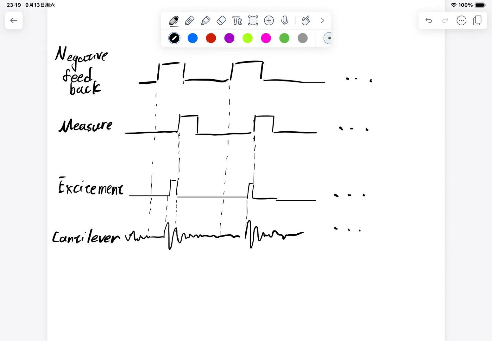

# Noise heating up 

# Zhen Wang

## Abstract

In this notebooks, we try to explain the general idea of free lunch experiment, and develop a theory used to decribe the therml fluctuation vs time.

## Minimum detectable freq shift

I found a ready-made conclusion in John's tech reports: assuming we only consider thermal noise, our minimum detectable frequency shift is defined as the root mean square of frequency noise multiplied by the detection bandwidth (this definition comes from The Minimum Detectable Force Concept). In the paper "Frequency Noise," we have this value:

$ \Delta f_{min}(f) = \sqrt{\frac{2 k_B Tf_0}{2\pi x^2_{rms}kQ}\Delta f}$

where k_B is the Boltzmann constant, T is the temperature, f0 is the characteristic frequency of the cantilever, k is the spring constant of the cantilever, Q is the quality factor, $\Delta f$ is the bandwidth, and $x^2_{rms}$ is the root mean square of the amplitude.

## Beat thermal noise

### General idea

John proposed the following experimental method:

“The idea is to apply negative feedback to cancel the thermomechanical fluctuations, quickly excite the cantilever, and measure the cantilever frequency before the thermal fluctuations have time to return.”

Also, we assume we are going to repeat this process several times.

### Frozen cantilever

We want to derive the equation of motion of the cantilever. Considering a classical damped harmonic oscillator, we have the following equation:
$m\frac{d^2x}{dt^2} + \Gamma\frac{dx}{dt} + kx = F(t)$

where m is the mass of the cantilever, $\Gamma$ is the damping constant, k is the spring constant, F(t) is the force applied to the cantilever, consisting of the driving force and the thermal noise, noted as $F_{d}(t)$ and $F_{th}(t)$, and $<F_{th}(t)> = 0$, $<F_{th}(t)F_{th}(t')> = D\delta(t-t')$. We are concerned with the situation after the negative feedback is removed, so we assume the cantilever remains completely still at t<0, applies the driving force $F_{d}(t)$ at 0< t < t1, and starts to have random noise $F_{d}(t)$ at t>0.

Letting x = x1+x2, and since we are using a second-order differential equation, we can set $x1(0) = x(0) = 0$, $x1'(0) = x'(0) = 0$, $x2(0) = 0$, $x2'(0) = 0$.

$m\frac{d^2x1}{dt^2} + \Gamma\frac{dx1}{dt} + kx1 = F_{d}(t)$
$m\frac{d^2x2}{dt^2} + \Gamma\frac{dx2}{dt} + kx2 = F_{th}(t)$

Thus, x1 purely describes the cantilever driven oscillation, and x2 purely describes the cantilever disturbed by random noise. We are interested in x2, which intuitively is a process of a cantilever at absolute zero being gradually heated in a thermal bath. We hope to understand the equation of $<x_{2rms}>(t)$, which represents the expectation of the root mean square of x2 at each moment under multiple averages. So this is essentially a thermal statistics problem, and we consider using stochastic differential equations and dissipation theory to solve this problem.

### Response time
Intuitively, since this is a heating process, we suspect it roughly follows an exponential process $<x_{2rms}>(t) = A(1-e^{-\frac{t}{\tau}})$, where A is a constant, and $\tau$ is the response time, which is our available measurement time, the average is average over multiple experiments. We will solve this problem. 

For simplicity, we rewrite the equation of motion as:

$\frac{d^2x}{dt^2} = -\frac{\omega_0}{Q}\frac{dx}{dt} - \omega_0^2x + F_{th}(t)$

We first want to confirm the correlation function of the noise. We assume the noise is completely random noise: $<F_{th}(t)F_{th}(t')> = D\delta(t-t')$

Then for the resonator, we consider three statistics: $<x^2>=a$, $<xx'>=b$, $<x'^2>=c$. We have the relation that:

$a' = 2<xx'> = 2b$,
$b' = <xx'>' = - \omega_0/Qb- \omega_0^2a+c$
$c' = <x'^2>' =  -2\omega_0/Qc- 2\omega_0^2b+D/m^2$

Note that we are using Ito's formula here, which contributes to the noise term in c'. The derivation of this noise term is in the appendix.

We assume we eventually get a steady-state solution, so all derivatives should be zero, and we can solve for $c = (DQ)/(m^2\omega_0) = <x'^2> = k_BT/m$, thus $D = k_BTm\omega_0/Q$

Note that we are concerned with the energy change of the resonator, which can be written as $<E> = m/2c+m\omega_0^2/2a$, the solution of which is:

$<E> = \frac{1}{2}k_BT(1+\exp(-\frac{\omega_0}{Q}t)
\frac{4\omega_0^2-(\omega_0/Q)^2\cosh{\sqrt{4\omega_0^2-(\omega_0/Q)^2}t}}{-4\omega_0^2+(\omega_0/Q)^2}) $

For high Q, denoting $\Omega = -4\omega_0^2+(\omega_0/Q)^2$, we have:

$<E> =  \frac{1}{2}k_BT(1+ \exp(-\frac{\omega_0}{Q}t)
\frac{4\omega_0^2-(\omega_0/Q)^2\sin{\sqrt{\Omega t}}}{\Omega}) $

The response time is $\frac{Q}{\omega_0}$

### The clock

There is another issue with this experiment: when we repeat this process multiple times, each experiment will accumulate a phase difference. The paper "Quantum sensing with arbitrary frequency resolution" mentioned this problem, and they set up an additional high-precision clock to track this phase difference.

## Appendix

### Ito's formula

We want to use Ito's formula to derive the contribution of the noise term, but since I have not systematically learned this theory, we take a more basic derivation method

For c':

$x'' = -\frac{\omega_0}{Q}x' - \omega_0^2x + F(t)/m$

$x''(t+dt) = x''(t) + ( -\frac{\omega_0}{Q}x'(t)- \omega_0^2x(t))dt + \int_{t}^{t+dt}F(s)/m ds$

letting $\int_{t}^{t+dt}f(s)/m ds = \epsilon/m$, we have$<\epsilon> = 0$, $<\epsilon^2> = D/m^2dt$

$<x'^2(t+dt)> = <x'^2(t)>+2<x'(t)(-\frac{\omega_0}{Q}x'(t)- \omega_0^2x(t))>dt+2< \epsilon x'>+<\epsilon^2> + o(dt^2) \\
=<x'^2(t)>-2\omega_0/Q<x'(t)^2>dt-2\omega_0^2<xx'>dt+D/m^2dt $

For b':

$x'' = -\frac{\omega_0}{Q}x' - \omega_0^2x + F(t)/m$

$x''(t+dt) = x''(t) + ( -\frac{\omega_0}{Q}x'(t)- \omega_0^2x(t))dt + \int_{t}^{t+dt}F(s)/m ds$

letting $\int_{t}^{t+dt}f(s)/m ds = \epsilon/m$, we have$<\epsilon> = 0$, $<\epsilon^2> = D/m^2dt$

$<xx'(t+dt)> = <xx'(t)>+<x'^2>dt+2<x(t)(-\frac{\omega_0}{Q}x'(t)- \omega_0^2x(t))>dt+<\epsilon/m x>+ o(dt^2)\\
=<xx'(t)>+<x'^2>dt-2\frac{\omega_0}{Q}<x(t)x'(t)>- \omega_0^2<x^2(t)>dt$
